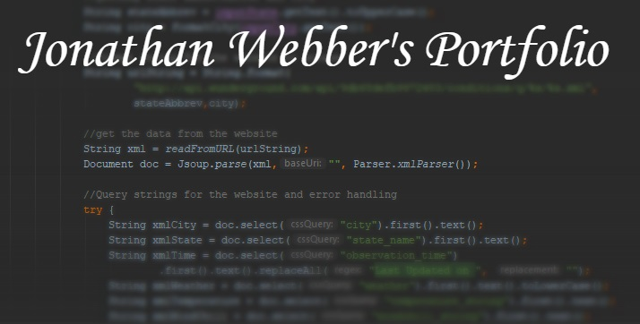

# Jonathan Webber's Portfolio

 ## Examples of Projects

- [Weather Application](https://github.com/jwebber1/Weather-App)
    A weather application using Intellij/JavaFX that pulls xml from Wunderground to display the weather of a given city and state.

- [Weekly Math Report](https://github.com/jwebber1/Weekly-Math-Report)
    A simple application used to reformat a weekly math report for my job.

- [Disaster Relief](https://github.com/jwebber1/DisasterRelief)
    Finding cities within given radius that are effected by a disaster.

- [Sonar Eclipse Website](https://github.com/jwebber1/SonarEclipseWebsite)
    A website I create using html, css, javascript, and php for a class. It represents buying and selling instruments.

- [Python Palindrome](https://github.com/jwebber1/PythonPalindrome)
    When given a user-defined string, checks to see if that string is a palindrome or not.
